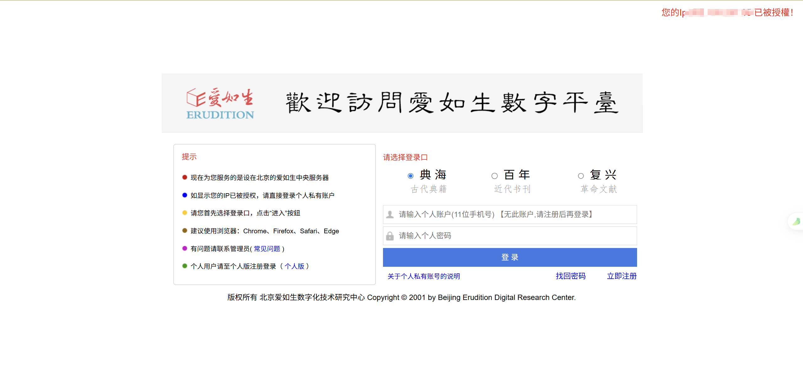
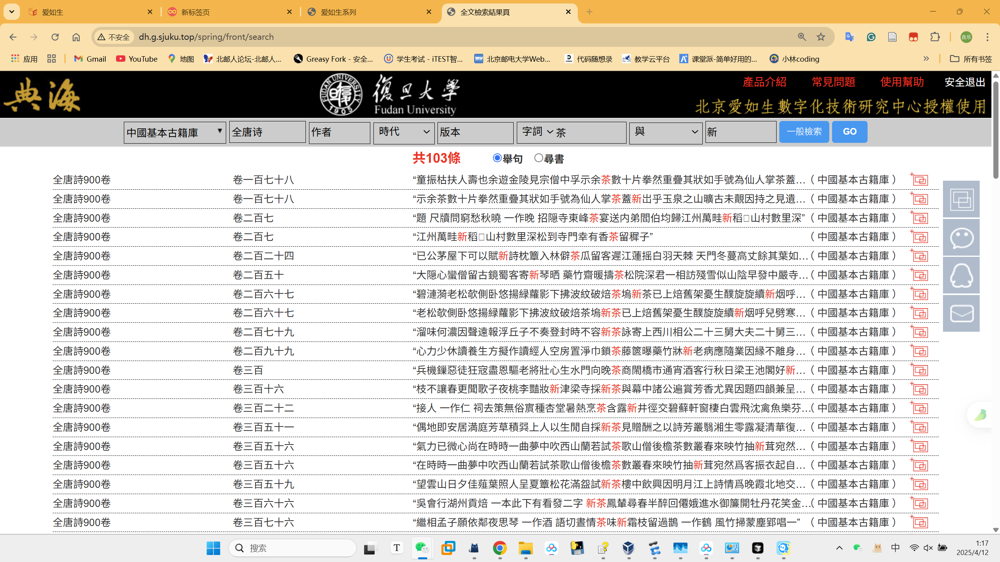

# Tangshi

### 任务描述

> 是这样，我想研究与“ 茶”搭配的词的变化（比如沏茶 泡茶 点茶，或者新茶 香茶）
> 所以第一步是要在古籍库里把与“茶”相关的结果都检索出来。
> 然后用分词和词性识别的方式把所有的动词/形容词都找出来，做成一个词云。
> 接下来就能分析了
>
>  在第一步古籍库检索这个过程中，这个古籍库没有办法一键导出全部的搜索结果，只能一页一页选中
>
> 古籍库里跟茶有关的结果有23万条，好几百页，我实在是不可能把这些一条一条勾选然后点击“导出”
>
> 这个就是我在用一个比较小的样本测试：先搜索全唐诗里的新茶，大概100多条，然后写一个代码把这100多条自动选中+自动翻页+反爬，全部导出

#### 网站＆登录方式

> http://www.90tsg.com
>
> 卡号：卡号：38955985密码：密码：333361
>
> 第一步，地址栏搜索网址，网址就用上面的。第二步再输入卡号和密码，第三步进入网站后，点古籍报刊库
>
> 里面的爱如生
>
> 用户名：1537993153
>
> 密码：wyl123456

**如图**

**搜索如图**

##### **==<u>其中E:\python_project\Spider_tangshi\.specstory\history中有我的提问记录</u>==**
